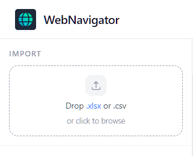
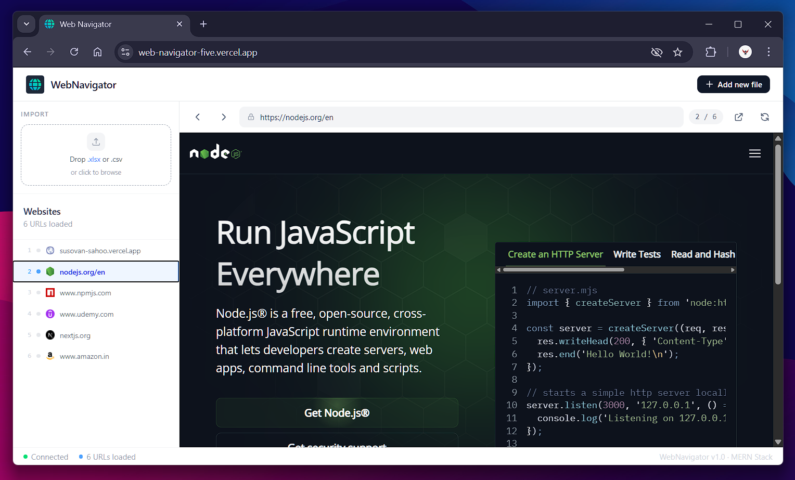
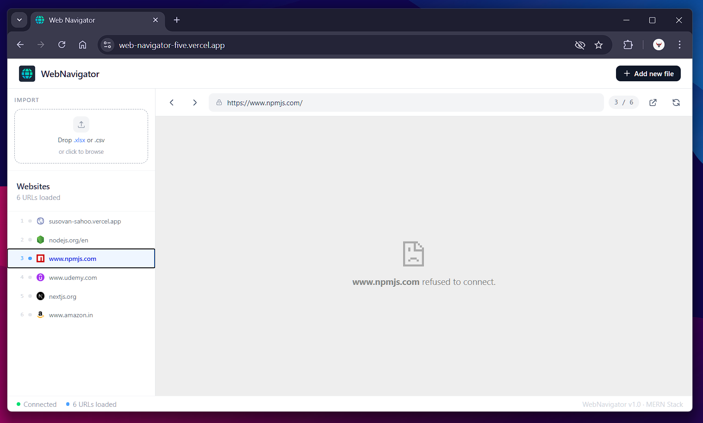

# WebNavigator

A full-stack MERN application that lets you upload an Excel or CSV file containing website URLs and navigate between them using Previous and Next buttons — all inside a built-in browser viewer.

Live Demo: [Web Navigator](https://web-navigator-five.vercel.app/)

---

## Screenshots

Upload a spreadsheet of URLs and browse them one by one — right inside the app.



## 

## Features

- Upload `.xlsx`, `.xls`, or `.csv` files containing website URLs
- Automatically extracts all URLs from any column in the file
- Displays websites in an embedded browser viewer
- Navigate using Prev / Next buttons or left / right arrow keys
- Click any URL in the sidebar to jump directly to it
- Graceful fallback screen for sites that block embedding
- Open any site in a new tab with one click
- URLs and session saved to MongoDB Atlas

---

## Stack

```
Frontend   React + Vite + Tailwind CSS
Backend    Node.js + Express.js
Database   MongoDB Atlas
Parsing    multer + xlsx
```

---

## Project Structure

```
website-navigator/
├── backend/
│   ├── config/
│   │   └── db.js
│   ├── src/
│   │   ├── controllers/
│   │   │   └── urlController.js
│   │   ├── middleware/
│   │   │   └── errorHandler.js
│   │   ├── models/
│   │   │   └── UrlSet.js
│   │   └── routes/
│   │       └── upload.js
│   ├── .env
│   ├── app.js
│   └── server.js
│
└── frontend/
    └── src/
        ├── api/
        │   └── upload.js
        ├── components/
        │   ├── BrowserViewer.jsx
        │   ├── NavBar.jsx
        │   ├── UploadZone.jsx
        │   └── UrlSidebar.jsx
        ├── hooks/
        │   └── useNavigator.js
        ├── App.jsx
        ├── main.jsx
        └── index.css
```

## Quick Start

**Backend**

```bash
cd backend
pnpm install
```

Create a `.env` file in the `backend/` folder:

```env
PORT=5000
MONGO_URI=your_mongodb_atlas_connection_string
CLIENT_URL=http://localhost:5173
```

Start the backend:

```bash
pnpm dev
```

The API will be running at `http://localhost:5000`. Verify with:

```
GET http://localhost:5000/
```

**Frontend**

```bash
cd frontend
pnpm install
```

Create a `.env` file in the `frontend/` folder:

```env
VITE_API_URL=http://localhost:5000
```

Start the frontend:

```bash
pnpm dev
```

Open `http://localhost:5173` in your browser.

---

## How to use

1. Prepare a spreadsheet with URLs in any column

   | Name     | URL                           |
   | -------- | ----------------------------- |
   | GitHub   | https://github.com            |
   | MDN Docs | https://developer.mozilla.org |

2. Upload it via the sidebar or the **Upload file** button
3. Navigate with the arrow buttons or keyboard ← →



---

## API

| Method | Endpoint      | Description                         |
| ------ | ------------- | ----------------------------------- |
| `GET`  | `/`           | Health check                        |
| `POST` | `/api/upload` | Upload file, returns extracted URLs |
| `GET`  | `/api/latest` | Fetch last uploaded URL set         |

### `POST /api/upload`

Accepts a multipart form upload and returns extracted URLs.

**Request**

| Field  | Type   | Description                     |
| ------ | ------ | ------------------------------- |
| `file` | `File` | `.xlsx`, `.xls`, or `.csv` file |

**Response**

```json
{
  "success": true,
  "id": "64f1a2b3c4d5e6f7a8b9c0d1",
  "urls": [
    "https://github.com",
    "https://developer.mozilla.org",
    "https://npmjs.com"
  ]
}
```

**Error response**

```json
{
  "success": false,
  "message": "No valid URLs found in file"
}
```

---

## Known Limitations

- Many popular sites (Google, GitHub, Twitter) block iframe embedding via `X-Frame-Options`. The app detects this and shows a fallback screen with an "Open in new tab" button.
- `multer.memoryStorage()` holds uploaded files in RAM. Very large spreadsheets (50MB+) may cause issues in production — consider `diskStorage` for those cases.

---

## License

MIT
